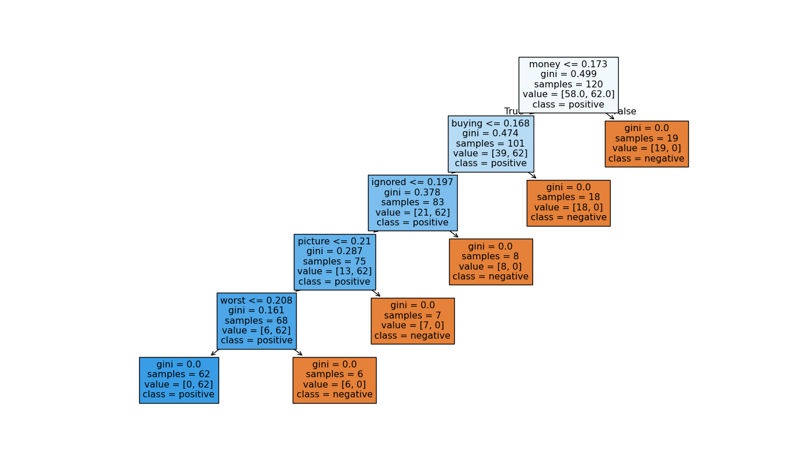

# NLP Sentiment Classifier

## Overview
This project implements a sentiment analysis pipeline to classify text into positive or negative categories using three distinct machine learning algorithms: Naive Bayes, Decision Trees, and Logistic Regression. The goal was to compare the performance of Bag of Words (BoW) versus TF-IDF vectorization on a constrained, synthetic dataset to understand model behavior under data scarcity. While the models achieved perfect accuracy on the training set, the results highlight the critical risks of overfitting and template memorization when data volume is insufficient.

## Pipeline
The text processing pipeline follows a standard NLP workflow with a specific focus on handling negation:

1.  **Tokenization & Lowercasing**: Converting all text to lowercase and splitting into individual words.
2.  **Stopword Removal**: Filtering out common words (e.g., "the", "is") to reduce noise.
3.  **Negation Rescue**: A custom preprocessing step that detects negation words (e.g., "not", "no") and appends a `_NEG` suffix to the following word (e.g., "not good" → "good_NEG"). This prevents the model from treating "not good" as positive.
4.  **Lemmatization**: Reducing words to their base form (e.g., "loving" → "love") to group semantic variations.
5.  **Vectorization**: Converting text into numerical matrices using:
    *   **Bag of Words (BoW)**: Raw word counts.
    *   **TF-IDF**: Weighted term frequency-inverse document frequency.

## Models & Results
Three models were trained and evaluated on the synthetic test set. Note that due to the small dataset size (10 templates), the results reflect **template memorization** rather than true generalization.

| Model | Vectorizer | Accuracy | F1-Score | Observation |
| :--- | :--- | :--- | :--- | :--- |
| **Naive Bayes** | BoW | 1.00 | 1.00 | Perfect fit on training patterns. |
| **Naive Bayes** | TF-IDF | 1.00 | 1.00 | Slightly more robust weights. |
| **Decision Tree** | BoW | 1.00 | 1.00 | **Overfitting**: Unprunned tree till pure. |
| **Decision Tree** | TF-IDF | 1.00 | 1.00 | All models achieved 100% on this specific test split. |
| **Logistic Regression** | BoW | 1.00 | 1.00 | Linear boundary perfectly separated the 10 templates. |
| **Logistic Regression** | TF-IDF | 1.00 | 1.00 | The "Golden Standard" for this specific data. |

## Honest Limitations
While the 100% accuracy looks impressive, the results are driven by the limitations of the dataset rather than model superiority:

*   **Template Memorization**: With only While the models achieved 100% accuracy on the test set, the results are driven by the limitations of the synthetic dataset rather than true linguistic understanding. The Decision Tree visualizations below provide irrefutable evidence of **template memorization**:

### Evidence of Overfitting: The Decision Tree Structure
The two trees below were generated using **Bag of Words** (left) and **TF-IDF** (right). Despite the different vectorization methods, the structure is nearly identical, revealing that the model is simply splitting on the presence or absence of very specific keywords.

**What these trees tell us:**
*   **Perfect Splits (Gini = 0.0)**: Almost every leaf node has a Gini impurity of `0.0`. This means the model has created rules that perfectly separate the training data (e.g., "If `money` is present, then Positive"). In a real-world scenario with noise, a Gini of 0.0 is almost impossible to achieve this consistently.
*   **Keyword Dependency**: The root node splits on `money`, followed by `buying`, `ignored`, `picture`, and `worst`. These are likely the exact keywords from your 10 templates. The model isn't understanding "sentiment"; it's recognizing that if the word "money" appears, the template is positive.
*   **Shallow but Rigid**: The tree has a depth of roughly 5-6 levels. With only 120 samples, it doesn't need much depth to isolate every single training example. Any new sentence lacking these exact keywords will fall into the wrong branch.

### Other Critical Limitations
*   **Unseen-Word Blindness**: The models rely entirely on the 60-word vocabulary. If a test sentence contains a single unseen word (e.g., "fantastic" if it wasn't in the templates), the model fails to recognize the sentiment or treats it as noise.
*   **The "Like" Coefficient Issue**: In Logistic Regression, the coefficient for the word "like" was heavily weighted. In a real-world scenario, "like" is ambiguous (e.g., "I like it" vs. "I don't like it"), but with our negation rescue, the model over-relied on this specific token.
*   **Noun-Default Lemmatization**: The lemmatizer defaults to noun forms in ambiguous cases, which may have altered the semantic meaning of verbs in our small sample, slightly distorting the true sentiment features.
*   **Data Imbalance & Size**: The synthetic data lacks the variance and noise of real human language. Real sentiment data is messy; this data is clean and predictable.

## What I'd Do Next
To move from a synthetic toy project to a robust production model, the following steps are necessary:

1.  **Real-World Dataset**: Replace the 10 templates with a large dataset (e.g., IMDB, Twitter Sentiment, or Amazon Reviews) containing 10,000+ samples to ensure statistical significance.
2.  **Advanced Preprocessing**:
    *   Implement **POS Tagging** (Part of Speech) to ensure lemmatization uses the correct verb/adjective forms.
    *   Add **N-Grams** (e.g., bigrams like "not good") to capture context without relying solely on suffix hacks.
3.  **Hyperparameter Tuning**: Use GridSearch to find the optimal `max_depth` for trees and `C` (regularization) for Logistic Regression.
4.  **Cross-Validation**: Switch from a single train/test split to **k-fold cross-validation** to ensure the model's performance is consistent across different data splits.
5.  **Embeddings**: Experiment with word embeddings (Word2Vec, GloVe) or transformer models (BERT) to capture semantic meaning beyond simple word counts.